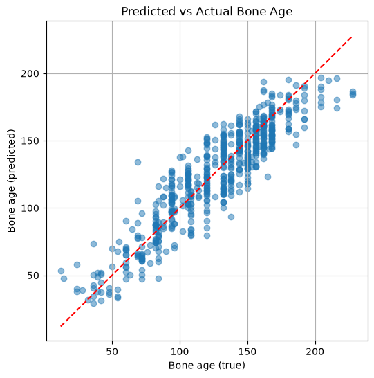

# Bone Age Regression from Hand X-Ray Images

This repository contains the project developed for the **Computing Methods for Experimental Physics** course at the **University of Pisa**.

The goal of the project is to estimate the **bone age of pediatric patients** from hand radiographs using deep learning techniques. We reproduced and extended the methodology proposed in the **RSNA Pediatric Bone Age Challenge**, exploring different neural network architectures and preprocessing pipelines.

This README provides installation instructions, usage examples, an overview of the implemented pipelines, and a summary of the obtained results.

---

## Dataset

The models were trained using the dataset released for the **RSNA Pediatric Bone Age Challenge**.

**Paper**

Halabi SS, Prevedello LM, Kalpathy-Cramer J, et al.

> **The RSNA Pediatric Bone Age Machine Learning Challenge**  
> Radiology, 2018.

https://pubs.rsna.org/doi/10.1148/radiol.2018180736

**Dataset**

https://www.rsna.org/artificial-intelligence/ai-image-challenge/rsna-pediatric-bone-age-challenge-2017

After downloading the dataset from the RSNA website, an initial data exploration step was performed.

Both the training and validation datasets are organized into two main components:

a folder containing the hand X-ray images in .png format;
a .csv file containing the corresponding metadata.
Each CSV file includes the radiograph ID, the patient's sex, and the bone age expressed in months. The patient's sex is reported through the male column, which contains boolean values.
An important preprocessing step was required because the training and validation CSV files used different column names for the same information. For this reason, the validation metadata table was renamed and reorganized to match the structure of the training table. This made the following preprocessing, training, and evaluation steps more consistent and easier to manage.

The original dataset provides two separate validation folders. In this project, the first validation subset, referred to as validation 1, was used as the validation set, while the second validation subset, referred to as validation 2, was used as the final test set.

---

## Features

- Bone age estimation from pediatric hand X-ray images
- Automatic hand segmentation using **BiRefNet**
- CNN-based deep learning models implemented in TensorFlow and PyTorch
- FiLM conditioning using patient sex
- Radiomics feature extraction with **PyRadiomics**
- Complete training and results notebooks
- Ready-to-use inference pipeline

---

## Hand Segmentation

Before training, all radiographs were segmented using **BiRefNet**, a state-of-the-art image segmentation model.

**Paper**

Zheng, P., Gao, D., Fan, D.-P., Liu, L., Laaksonen, J., Ouyang, W., & Sebe, N.

> **Bilateral Reference for High-Resolution Dichotomous Image Segmentation**  
> CAAI Artificial Intelligence Research, 2024.

https://arxiv.org/abs/2401.03407

**Repository**

https://github.com/ZhengPeng7/BiRefNet

The repository also provides utility scripts to:

- segment new datasets
- convert segmented RGBA images into grayscale images suitable for training

---

## Installation

Clone the repository:

```bash
git clone https://github.com/SilvioDraetta/Bone-Age-Regression-from-Hand-X-Ray-Images.git

cd Bone-Age-Regression-from-Hand-X-Ray-Images
```

Install the package:

```bash
python -m pip install .
```

---

## Quick Start

Predict the bone age of a new hand radiograph:

```bash
python main.py \
    --image data/PathToYourImage/image.png \
    --sex female
```

For additional examples, see the `demo/` notebook.

---

## Pipeline

The default inference pipeline consists of:

1. Hand segmentation using **BiRefNet**
2. RGBA to Grayscale conversion
3. Bone age prediction using the best-performing FiLM CNN model

---

## Models Evaluated

Several approaches were investigated during the project.

| Model | Description | Test MAE (months)|
|:------|:------------|---------:|
| CNN (TensorFlow) | Trained on original images | **13.61** |
| CNN (TensorFlow) | Tested on segmented images | **22.68** |
| CNN (PyTorch) | Trained on segmented images | **13.07** |
| CNN (PyTorch) | Tested on original images | **16.18** |
| CNN + FiLM | Segmented images + patient sex | **9.45** |
| CNN + FiLM | Original images + patient sex | **18.52** |
| Random Forest + Radiomics | PyRadiomics features extracted from segmented images | **23.51** |

The first TensorFlow model performed poorly on segmented images, suggesting that it relied on contextual information outside the hand, especially for younger patients.

Training exclusively on segmented images significantly improved the robustness of the CNN-based models.

The best-performing architecture combines image features with the patient's sex through a **Feature-wise Linear Modulation (FiLM)** layer, achieving a **Mean Absolute Error (MAE) of 9.45 months** on the segmented test set (image below).

As an alternative approach, handcrafted radiomics features were extracted from segmented hand radiographs using **PyRadiomics** and used to train a **Random Forest Regressor**. The model achieved a **MAE of 23.51 months**. Feature importance analysis indicated that texture descriptors—particularly **Gray Level Non-Uniformity** and **Long Run Emphasis**—together with the patient's sex were among the most informative predictors.



---

## Repository Structure

```text
BoneAge/
│
├── data/                           # Dataset and raw images 
│
├── notebook/
│   └── model_results/
│       ├── 00_cnn.ipynb
│       ├── 01_cnn_results.ipynb
│       ├── 02_cnn_torch.ipynb
│       ├── 03_cnn_torch_results.ipynb
│       ├── 04_cnn_torch_male_results.ipynb
│       └── 05_ML.ipynb
│
├── scripts/                         # Utility scripts (training, evaluation, etc.)
│
├── src/
│   ├── config/                      # Configuration files
│   ├── model/                       # ML/DL models
│   ├── pipeline/                    # Pipeline orchestration modules
│   ├── preprocessing/               # Image preprocessing functions
│   ├── utils/                       # Helper utilities
│   ├── visualization/               # Plotting and visualization tools
│   ├── init.py
│   └── engine.py                    # Main engine for running the pipeline
│
├── tests/                           # Unit tests
│
├── .gitignore
├── demo.ipynb                       # Demo for main usage
├── LICENSE
├── main.py                          # Entry point for running the project
├── pyproject.toml                   # Project configuration and dependencies
├── README.md                        # Main documentation
├── requirements-radiomics.txt       # Python 3.8.10 for PyRadiomics
└── requirements.txt                 # Main environment
```

---

## API Overview

The source code is organized into reusable modules inside the `src/` package.

### `src.model`

Contains the neural network architectures developed during the project, including the FiLM-based CNN model.

### `src.pipeline`

Contains the modules used by the main inference pipeline, including model loading and prediction utilities.

### `src.preprocessing`

Contains the preprocessing functions used to prepare the data before training and inference.

The preprocessing modules are:

* `datasets_radiomics`: utilities for loading segmented images and extracting radiomics features;
* `datasets`: dataset classes and image loading utilities;
* `rgba_conversion`: functions for converting segmented RGBA images into grayscale images;
* `scaling`: utilities for scaling target values and preparing datasets;
* `segmentation`: functions for hand segmentation using BiRefNet;
* `transforms`: image transformations used during model training and evaluation.

### `src.utils`

The `dataframe_utils` module provides functions for creating and organizing the project dataframes.

### `src.visualization`

Contains plotting utilities, including functions for visualizing training and validation loss curves.

### `src.engine`

Contains the PyTorch training pipeline, including:

* early stopping;
* training for one epoch;
* validation;
* complete model training loop.

---

## Utility Scripts

The `scripts/` directory contains standalone utilities used during dataset preparation.

| Script | Description |
|:-------|:------------|
| `image_segmentation.py` | Segments hand radiographs using BiRefNet. |
| `rgba_to_grayscale.py` | Converts segmented RGBA images into grayscale images suitable for training. |

---

## Notebooks

The notebooks document the main experimental stages of the project, from baseline training to model evaluation and radiomics analysis.

| Notebook | Description                                                                                   |
| :------- | :-------------------------------------------------------------------------------------------- |
| `00_...` | Baseline TensorFlow CNN trained on original radiographs.                                      |
| `01_...` | Evaluation and results of the TensorFlow CNN baseline.                                        |
| `02_...` | PyTorch CNN training on segmented images, with and without FiLM conditioning.                 |
| `03_...` | Evaluation of the PyTorch CNN trained without patient sex information.                        |
| `04_...` | Evaluation of the PyTorch CNN trained with patient sex information through FiLM conditioning. |
| `05_...` | Radiomics feature extraction and Random Forest regression baseline.                           |

In notebook `02_...`, both PyTorch CNN models are trained using the same training pipeline. The `train_model` function includes the `use_male` parameter: when `use_male=False`, the model is trained using only image information; when `use_male=True`, patient sex is included through the FiLM conditioning mechanism.

---
## Environment setup

This project uses two separate Python environments due to dependency compatibility requirements.

### CNN environment

Used for the TensorFlow and PyTorch pipelines and requires:

```text
Python >= 3.10 

### Radiomics environment

Used for the PyRadiomics pipeline and requires:

```text
Python 3.8.10

---

## References

**[1]**

Halabi SS, Prevedello LM, Kalpathy-Cramer J, et al.

**The RSNA Pediatric Bone Age Machine Learning Challenge.**

*Radiology*, 2018.

https://pubs.rsna.org/doi/10.1148/radiol.2018180736

---

**[2]**

Zheng, P., Gao, D., Fan, D.-P., Liu, L., Laaksonen, J., Ouyang, W., & Sebe, N.

**Bilateral Reference for High-Resolution Dichotomous Image Segmentation.**

*CAAI Artificial Intelligence Research*, 2024.

https://arxiv.org/abs/2401.03407

https://github.com/ZhengPeng7/BiRefNet

